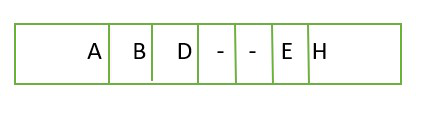
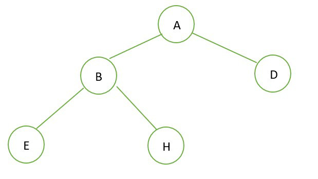
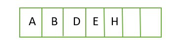
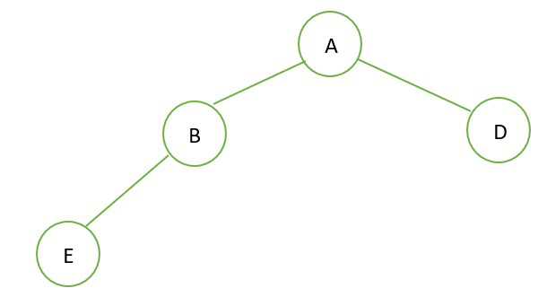
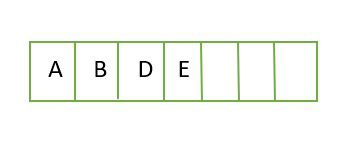
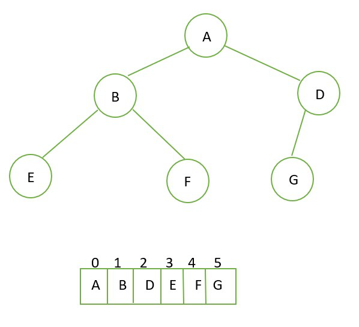
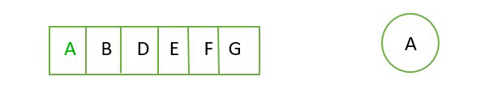
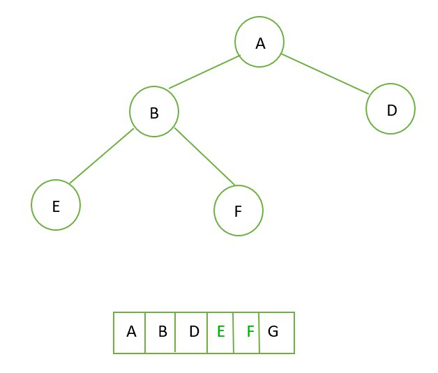
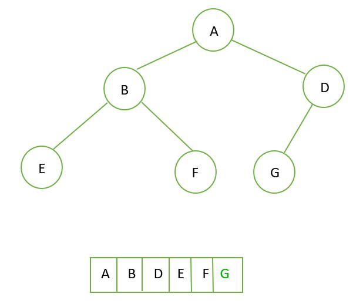

# 완전 이진 트리

## [완전 이진 트리]()란?

> #### "이진 트리의 특별한 형태로서, 마지막 레벨을 제외한 모든 노드가 차있으며,
> 
> #### 마지막 노드는 왼쪽부터 채운 트리형 자료구조를 말합니다."

### 완전 이진 트리의 특성

* 깊이
  
  * 이진 트리의 리프노드는 모두 같은 깊이를 가져야 합니다.

* 노드의 개수 ~ 노드의 높이와의 관계
  
  * 깊이가 d일 때, 최대 ***2^d - 1*** 개의 노드를 가집니다.
  
  * n개의 노드를 가진 트리의 높이는 ***log(n+1)*** 입니다.

* 마지막 노드를 제외하고는 꽉 차있습니다.

### Full Binary Tree와의 차이점

* Full Binary Tree : O / Complete Binary Tree : X
  
  * 왼쪽부터 채워지지 않았기 때문

* Full Binary Tree : O / Complete Binary Tree : O

* Full Binary Tree : X / Complete Binary Tree : O
  
  * 한 쪽만 채워져있는 경우가 있기 때문

* Full Binary Tree : X / Complete Binary Tree : X
  
  * 한 쪽만 채워져있는 경우가 있고
  
  * 왼쪽부터 채워지지 않았기 때문

### 완전 이진 트리 만들기

이런 모양의 트리를 만들어봅시다.

* 기본 알고리즘
  
  1. tree가 비었으면 root에 넣는다
  
  2. 비지 않았다면 각 노드들을 탐색한다
     
     1. 왼쪽이 비었으면 왼쪽에
     
     2. 오른쪽이 비었으면 오른쪽에 넣는다

* 만들기
  
  1. 첫번째로 root를 넣습니다
     
     
  
  2. 왼쪽과 오른쪽에 자식을 채웁니다.
     
     
3. 왼쪽 노드의 자식을 채웁니다.
   
   
   
   4. 오른쪽 노드의 자식을 채웁니다.
   
   
   
   5. 완성!
