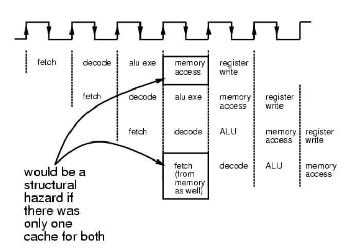
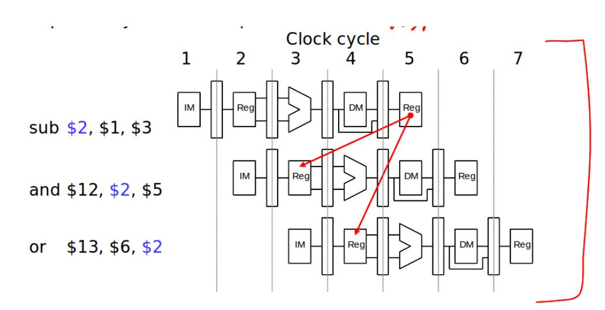
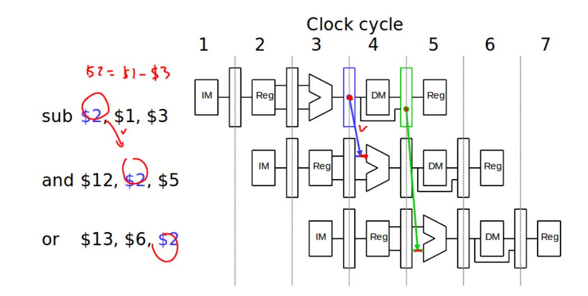
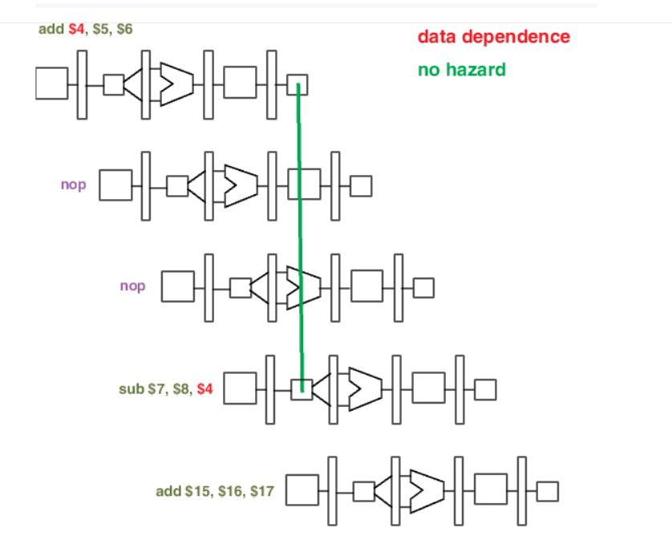
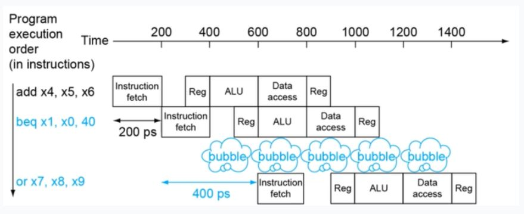
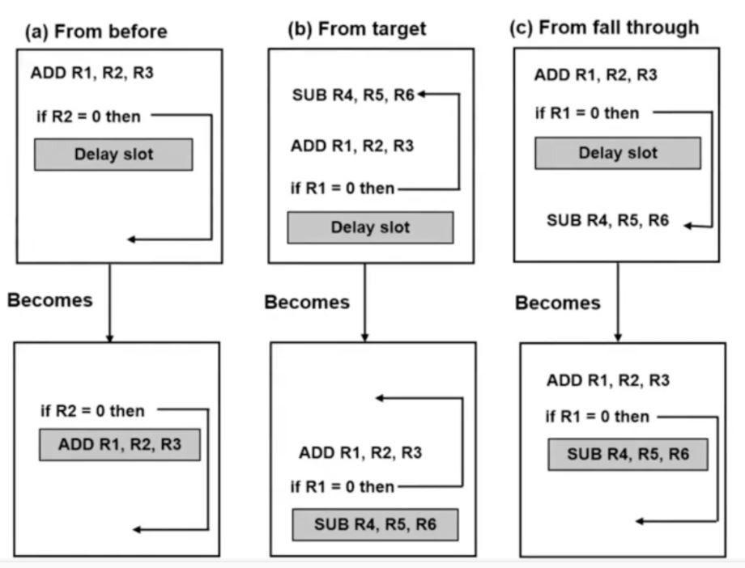

# 파이프라인 해저드

### 명령어 파이프라이닝이란?
앞에서 언급했듯이 프로세서에 의해 취해진 산술적인 단계가 연속적이고 다소 겹쳐서 수행되는 것을 의미.

명령어 파이프라이닝을 통해 하나의 명령어를 처리하는 동안 다음번 명령어를 가지고 올 수 있음

## 파이프라인 해저드란?
다음 명령어가 다음 Clock  Cycle에서  정상적으로 수행되지 못하는 것

이상적인 파이프라인은 CPI가 1인 구조 (CPI = 1)을 취함. 하지만 Hazard가 발생하게 된다면, CPI가 1보다 높아지거나 원치 않은 연산결과를 얻을 수 있음

* CPI란?
  
  Cycle Per Instrction이라고 하며, 명령(Instruction) 당 CPU의 사이클 횟수를 의미한다. 즉, 명령 하나당 한 사이클이 가장 이상적인 상태 (CPI=1) 이다.

## 파이프라인 해저드의 종류

구조적 해저드 (Structural Hazard)

데이터 해저드 (Data Hazard)

제어 해저드 (Control Hazard)

## 구조적 해저드 (Structural Hazard)

말 그대로 하드웨어의 구조상 해저드가 발생하는 경우를 의미한다.

모든 명령 수행이 위와 같이

> IF - ID - EX - MEM - WB

의 구조를 가진다고 생각해보자.

위의 그림과 같은 경우, 메모리를 동시에 접근 시도하기 때문에 Resource Conflict, 즉 자원을 동시에 접근 시도하는 문제가 발생한다.

이럴 때 메모리는 어디서 누가 Signal을 줬는지 알 수 있을까?

**즉 하드웨어 구조적인 문제로 Hazard가 발생하는 것이다.**

## 구조적 해저드의 해결 방법

1. 돈을 더 쓴다 (하드웨어를 늘린다)
   
   단순히 위와 같은 경우에도, 메모리 하드웨어가 더 있었다면? 문제가 없다.
   
2. Stall을 한다
   
   즉 위와 같은 일이 발생하면 인위적으로 Instruction의 수행을 멈추는 것이다.
   비용적인 증가는 없지만 성능 저하가 발생할 수 있다.

## 데이터 해저드 (Data Hazard)

사용자가 원하는 답을 내놓지 못하는 경우.

데이터의 Read / Write 시퀀스가 어긋나는 경우 발생한다. 즉, 첫 번째 Instruction의 결과가 이후의 Instruction에 영향을 줄 경우 발생한다.

### 종류
* Read After Write(RAW)

명령어가 수행 후 저장되지 않았는데 다음 명령어가 수행되는 경우.

위의 경우, sub 연산이 완료되지 않았는데도 다음 연산 수행을 시도한다.

* Write After Write(WAW)

* Write After Read(WAR)

### 해결법
* 하드웨어적 해결방안 (Fowarding 혹은 Bypassing)

ALU를 거친 후의 동작은 결국 메모리에 값을 저장하기 위한 행동이다.
(ALU는 그림의 > 모양 블럭이다. Arithmetic and Logical Unit의 약자로, 연산 유닛 즉 계산을 하는 부분이라고 생각하면 된다.)

즉, 연산 직후의 결과를 다음 Instruction으로 보내면 된다.

이것을 Fowarding 혹은 Bypassing 이라고 말한다.

* 소프트웨어적 해결방안 (Code Scheduling)

단순히 앞 연산이 끝날 때까지, nop 처리 즉 instruction을 수행하지 않는 방법으로 처리한다.

## 제어 해저드(Control Hazard)

Branch 명령어로 인해 발생하는 해저드이다.

위의 경우 BEQ(Branch if Equal : 값이 동일할 시 분기) 명령어가 끝날 때까지 기다려야 함

분기 명령어의 경우, 분기가 실행되면 Target Address 위치로 명령어를 건너뛰는 명령어임

* BEQ의 결과, 분기를 해야하고 그 밑의 명령어를 다 버려야 한다면?

### 해결 방법
1. 단순 Stall을 한다
   
   BEQ명령어가 끝날 때까지 기다린다.

   하지만 성능 저하가 심각하다 (위의 경우 3 clock을 손해본다.) 최대 75%까지 성능 저하가 발생한다고 함.

2. 예측(Prediction)
   
   Taken인가 Not-Taken인가? 즉 분기가 일어날 것인가 일어나지 않을 것인가?

   Branch가 일어나지 않을 것이라고 무조건 가정

   Not-Taken일 경우 분기를 진행하지 않고 계속 진행

   Taken일 경우 분기를 진행하면 되고, 앞에서 진행했던 명령은 그냥 버리면 됨.

   * 종류
     
     Never Branch : 항상 분기가 일어나지 않는다고 베팅

     Always Branch : 항상 분기가 일어난다고 베팅
     
     Predict by Op-code : BEQ / BNE에 따라 예측

3. 지연 (Delayed Branch)
   
   Branch의 방향과는 상관없이 무조건 실행하는 것

   Branch가 끝날 때까지 한 clock만 NOP로 처리

   * Delay Slot
    
        NOP에 의미있는 명령어를 넣으면 어떨까?
        

   