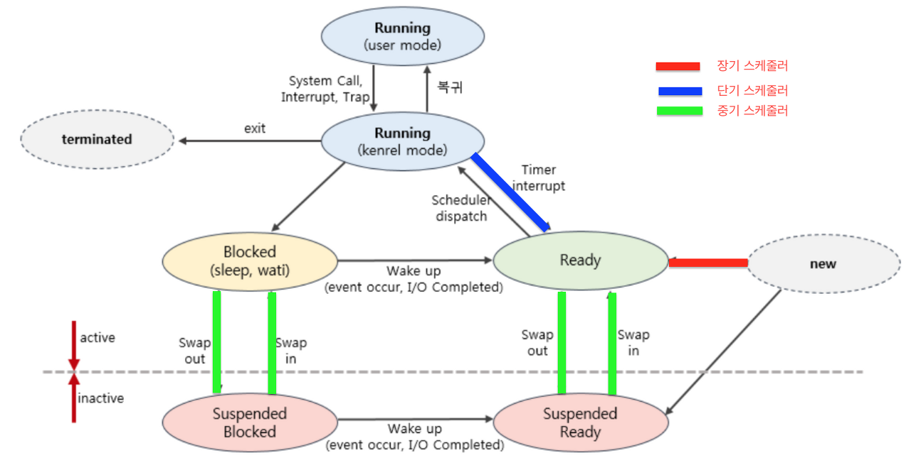

# 장기 스케줄러

## 스케줄링을 왜 하는가?
* 다중 프로그래밍에서 프로세서(CPU)를 할당할 프로세스를 선택할 때 전략이 필요하기 때문

* 프로세서 이용률을 높이고
* 프로세서 처리율을 증가하기 위함

## 장기 스케줄러란?
* 작업 스케줄러 / 승인 스케줄러 라고도 함
* **디스크 내의 작업을 어떤 순서로 메모리에 가져올 것인지?**
* 저장 장치에 작업을 저장 -> 필요할 때 작업 큐에서 꺼내 메인 메모리에 적재

## 장기 스케줄러의 특징
* 수십 초 내지 수 분 단위로 가끔 호출됨
  * 속도가 느린 것이 허용됨
* 메모리에 동시에 올라가 있는 프로세스의 수를 조절하는 역할도 함

## 현대의 장기 스케줄러
* 사실상 없음
* 적은 양의 메모리를 관리하기 위한 과거의 기술..
  * 지금은 프로세스가 시작되면 바로 그 프로세스에 메모리를 할당