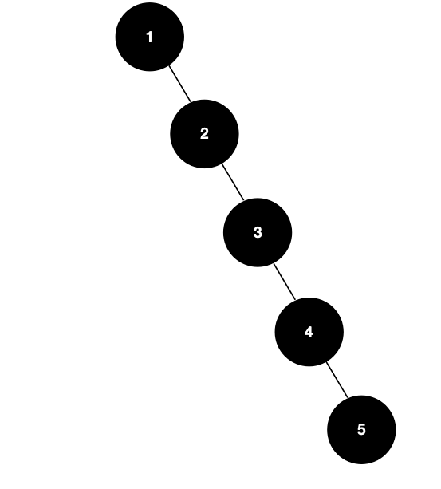
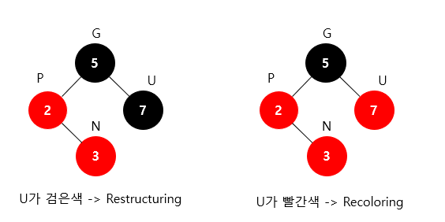
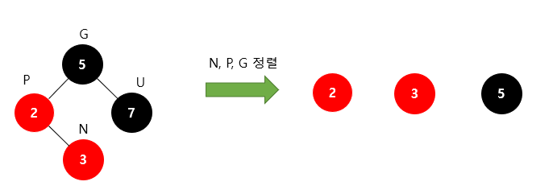
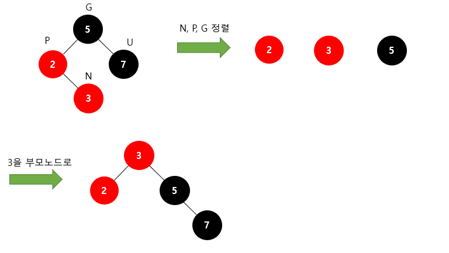
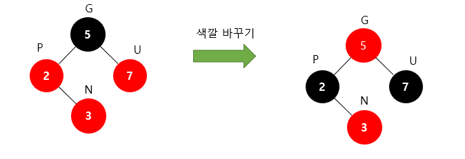
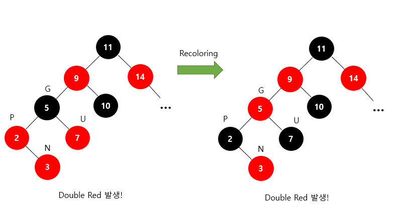
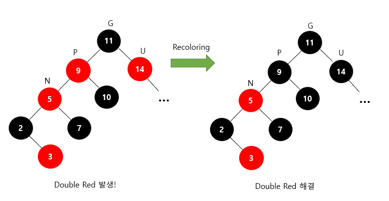

# Red-Black Tree

## Red-Black Tree란?
자가 균형 이진 탐색 트리 (Self-Balancing Binary Search Tree)이다.

### 근데 그게 무슨 말이에요?
먼저 이진 탐색 트리에서 비효율적인 예시를 살펴보자.

* 위 예시의 경우
  * 이진 탐색 트리의 조건은 만족
  * 하지만 탐색 시간은 O(N)으로, 굉장히 비효율적

*따라서 위와 같은 경우를 막는 이진 탐색 트리가 Red-Black Tree이다*

## Red-Black Tree의 특성
1. 모든 노드는 빨간색 혹은 검은색이다
2. 모든 루트 노드는 검은색이다
3. 모든 리프 노드 (NIL)들은 검은색이다. (Null Leaf : 자료를 갖지 않고, 트리의 끝을 나타냄)
4. 빨간색 노드의 자식은 검은색이다
   1. 즉, 빨간색 노드가 연속으로 나올 수 없다. (No Double Red!)
5. 모든 리프 노드에서 Black Height는 같다
   1. 리프노드에서 루트 노드까지 가는 경로에서 만나는 검은색 노드의 개수가 같다.

### 위의 특성을 유지하기 위해..
주로 Double-Red를 방지하기 위해 전략을 취한다. 그런데, **새로운 노드는 항상 Red이다!**

1. Restructuring
   1. 삼촌 노드가 검은색인 경우
2. Recoloring
   1. 삼촌 노드가 빨간색인 경우

G : 조상 // P : 부모 // U : 삼촌 // N : 자기 자신

## 각 과정을 좀 더 세부적으로 알아보자.
### Reconstructing

1. N,P,G를 오름차순 정렬
2. 셋 중 중간값을 부모로 만듦, 나머지 둘을 자식으로
3. 새로 부모가 된 노드를 검정색으로, 나머지 자식을 빨간색으로

N,P,G를 오름차순으로 정렬한 모습

정렬된 값의 중간값인 3을 부모로 만듦.

단, 5의 자식인 7은 자동적으로 딸려감!

부모인 3을 검정색으로, 나머지 자식을 빨간색으로 만든다.

### 주의점
**여기서 "2"가 Red인데 Leaf이지 않은가?**

아니다. 모든 말단 노드는 NIL을 자식으로 가진다. 즉, 무조건 Black이 말단이 된다.

### Recoloring

1. 새 노드(N), 부모(P), 삼촌(U)를 검은색으로 바꾸고, 조상(G)을 빨간색으로 바꿈
   1. 조상(G)이 루트라면 : 검은색으로
   2. 조상(G)을 빨간색으로 바꿨을 때 Double Red가 발생 -> 또 Restructing or Recoloring 진행

P,U를 검정색으로 바꿈

부모 노드도 검정색으로 바꿈

* Double-Black은 괜찮음! 조건 만족

단, 조상 노드(G)가 Root가 아닌 경우

3을 삽입 후, G를 빨간색으로, P,U를 검정색으로 하는 Recoloring 진행

Double Red 발생

삼촌(U)이 빨간색이므로 Recoloring 진행

만약 삼촌(U)이 검정색이었으면, Reconstructing 진행하면 된다.