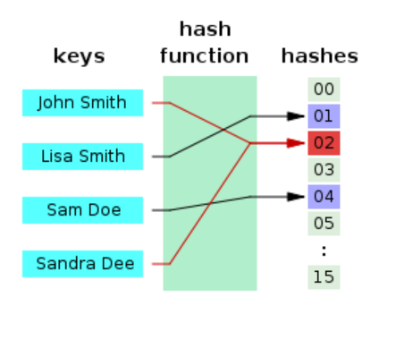
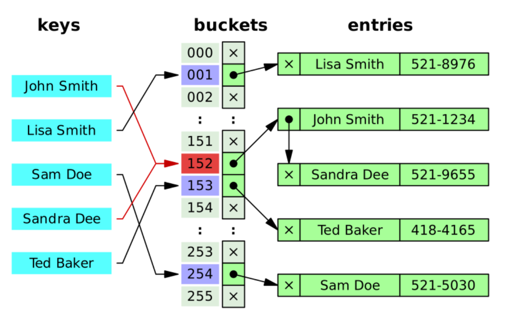

# Hash Table

- python dictionary 
- key - value
- 시간 복잡도: 평균 O(1)
  - 최악의 경우  O(n)이 될수도,,
- 내부에 array 같은 구조가 있지만 빠르다
  - 해시 함수 

- 빠른 데이터 검색이 필요할때 유용하다.
- key 값에 해시태그 함수를 적용해서 고유한 index를 생성하여 그 index에 저장된 값을 꺼내오는 구조.

- 해시 충돌

  - 각기 다른 key에 대하여 해시함수가 동일한 함수를 준 경우

  - 해결방법: chaining 과 open addressing으로 해결할 수있다. 

  - 충돌만 아니라면 해시 테이블은 시간복잡도 O(1)을 가진 효율적인 자료구조 

    

    

## separate chaining - 연결법

- **해시 충돌을 피하기 위해 제안된 자료구조 중 하나.**

- **닫힌 어드레싱 방법** 

  - 닫힌 어드레싱 방법은 무슨일이 있어도(충돌이 발생해도) 자신의 자리에 저장한다는 뜻이다. 
  - 이것이 가능하게 하려면 값을 저장할 자리를 여러개 마련하는 것이다.
  - 여러개의 자리를 마련하는 방법은 배열을 이용하거나 연결리스트를 이용하는것이다. 

- 일반적으로 Open Addressing 은 Separate Chaining 보다 느리다. Open Addressing 의 경우 해시 버킷을 채운 밀도가 높아질수록 Worst Case 발생 빈도가 더 높아지기 때문이다. 반면 Separate Chaining 방식의 경우 해시 충돌이 잘 발생하지 않도록 보조 해시 함수를 통해 조정할 수 있다면 Worst Case 에 가까워 지는 빈도를 줄일 수 있다. Java 7 에서는 Separate Chaining 방식을 사용하여 HashMap 을 구현하고 있다. 

- **Separate Chaining 방식으로는 두 가지 구현 방식**이 존재한다.

  - **연결 리스트를 사용하는 방식(Linked List)** 

  - 배열은 충돌이 발생하지 않을 경우 메모리 낭비가 심하고 충돌의 최대 횟수를 결정해야 하는 부담이 있으므로 연결 리스트를 이용하여 슬롯을 연결하는 방법이 닫힌 어드레싱 방법을 대표한다.

  - 각각의 버킷(bucket)들을 연결리스트(Linked List)로 만들어 Collision 이 발생하면 해당 bucket 의 list 에 추가하는 방식이다. 연결 리스트의 특징을 그대로 이어받아 삭제 또는 삽입이 간단하다. 하지만 단점도 그대로 물려받아 작은 데이터들을 저장할 때 연결 리스트 자체의 오버헤드가 부담이 된다. 또 다른 특징으로는, 버킷을 계속해서 사용하는 Open Address 방식에 비해 테이블의 확장을 늦출 수 있다.

    

    - Sandra Dee의 값이 153에 들어가려고 하는데 이미 값이 있다. 그래서 기존의 John Smith값 뒤에 연결시켰다.
      즉, 체이닝은 자료 저장시, 저장소(bucket)에서 충돌이 일어나면 **해당 값을 기존 값과 연결시키는 기법**이다.

      상대적으로 적은 메모리를 사용한다는 장점이 있지만 한 해시에 자료들이 계속 연결된다면(쏠림현상이 생긴다면) 검색 효율이 낮아진다는 단점이 있다.

  - **Tree 를 사용하는 방식 (Red-Black Tree)** 기본적인 알고리즘은 Separate Chaining 방식과 동일하며 연결 리스트 대신 트리를 사용하는 방식이다. 연결 리스트를 사용할 것인가와 트리를 사용할 것인가에 대한 기준은 하나의 해시 버킷에 할당된 key-value 쌍의 개수이다. **데이터의 개수가 적다면 링크드 리스트를 사용하는 것이 맞다.** 트리는 기본적으로 메모리 사용량이 많기 때문이다. 데이터 개수가 적을 때 Worst Case 를 살펴보면 트리와 링크드 리스트의 성능 상 차이가 거의 없다. 따라서 **메모리 측면을 봤을 때 데이터 개수가 적을 때는 링크드 리스트를 사용한다.**

  ***데이터가 적다는 것은 얼마나 적다는 것을 의미하는가?\*** 앞에서 말했듯이 기준은 하나의 해시 버킷에 할당된 key-value 쌍의 개수이다. 이 키-값 쌍의 개수가 6 개, 8 개를 기준으로 결정한다. 기준이 두 개 인것이 이상하게 느껴질 수 있다. 7 은 어디로 갔는가? 링크드 리스트의 기준과 트리의 기준을 6 과 8 로 잡은 것은 변경하는데 소요되는 비용을 줄이기 위함이다.

  ***한 가지 상황을 가정해보자.\*** 해시 버킷에 **6 개** 의 key-value 쌍이 들어있었다. 그리고 하나의 값이 추가되었다. 만약 기준이 6 과 7 이라면 자료구조를 링크드 리스트에서 트리로 변경해야 한다. 그러다 바로 하나의 값이 삭제된다면 다시 트리에서 링크드 리스트로 자료구조를 변경해야 한다. 각각 자료구조로 넘어가는 기준이 1 이라면 Switching 비용이 너무 많이 필요하게 되는 것이다. 그래서 2 라는 여유를 남겨두고 기준을 잡아준 것이다. 따라서 데이터의 개수가 6 개에서 7 개로 증가했을 때는 링크드 리스트의 자료구조를 취하고 있을 것이고 8 개에서 7 개로 감소했을 때는 트리의 자료구조를 취하고 있을 것이다.

  #### `Open Address` vs `Separate Chaining`

  일단 두 방식 모두 Worst Case 에서 O(M)이다. 하지만 `Open Address`방식은 연속된 공간에 데이터를 저장하기 때문에 `Separate Chaining`에 비해 캐시 효율이 높다. 따라서 데이터의 개수가 충분히 적다면 `Open Address`방식이 `Separate Chaining`보다 더 성능이 좋다. 한 가지 차이점이 더 존재한다. `Separate Chaining`방식에 비해 `Open Address`방식은 버킷을 계속해서 사용한다. 따라서 `Separate Chaining` 방식은 테이블의 확장을 보다 늦출 수 있다.

  #### 보조 해시 함수

  보조 해시 함수(supplement hash function)의 목적은 `key`의 해시 값을 변형하여 해시 충돌 가능성을 줄이는 것이다. `Separate Chaining` 방식을 사용할 때 함께 사용되며 보조 해시 함수로 Worst Case 에 가까워지는 경우를 줄일 수 있다.

##### Reference

- http://d2.naver.com/helloworld/831311