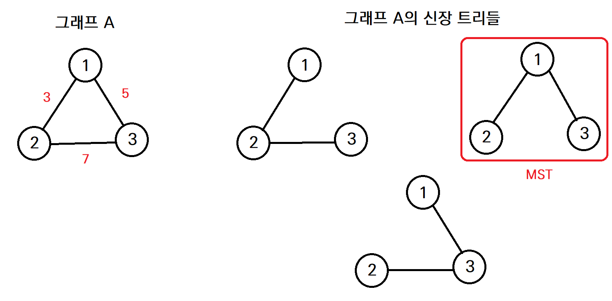
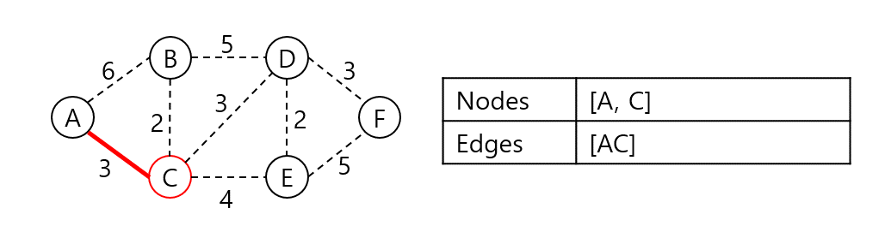

# 최소 신장 트리

- 무방향 그래프에서 간선들의 가중치 합이 최소인 신장트리 

- 아래 그리에서 3개의 신장트리 중 오른쪽 신장 트리의 가중치 합이 8로 가장 적으므로, 해당 신장트리가 그래프 A의 최소 신장트리가 된다.

  




## 프림 알고리즘(Prim's Algorithm)이란?

**최소신장트리**구현에 사용되는 알고리즘으로 시작 정점에서 정점을 추가해가며 단계적으로 트리를 확장하는 기법이다.

그리디 알고리즘 기반으로 구현한다. 다만 크루스칼 알고리즘과 동작 방식은 유사하나 간선 선택을 중심으로 동작했던 크루스칼 알고리즘과는 달리 정점을 기준으로 탐색을 진행한다. 시작 정점에서 출발하여 신장 트리 집합을 단계적으로 확장해나간다.

- Kruskal's algorithm 과 Prim's algorithm 비교
  - 둘다, 탐욕 알고리즘을 기초로 하고 있음 (당장 눈 앞의 최소 비용을 선택해서, 결과적으로 최적의 솔루션을 찾음)
  - Kruskal's algorithm은 가장 가중치가 작은 간선부터 선택하면서 MST를 구함
  - Prim's algorithm은 특정 정점에서 시작, 해당 정점에 연결된 가장 가중치가 작은 간선을 선택, 간선으로 연결된 정점들에 연결된 간선 중에서 가장 가중치가 작은 간선을 택하는 방식으로 MST를 구함

## 프림 알고리즘의 동작

프림 알고리즘은 매 순간 최선의 조건을 선택하는 그리디 알고리즘을 바탕에 둔다. 즉, 탐색 정점에 대해 연결된 인접 정점들 중 비용이 가장 적은 간선으로 연결된 정점을 선택한다.

1. 시작 단계는 시작 노드만이 MST 집합에 속한다.
2. 트리 집합에 속한 정점들과 인접한 정점들 중 가장 낮은 가중치의 간선과 연결된 정점에 대해 간선과 정점을 MST 트리 집합에 넣는다. (사이클을 막기 위해 연결된 정점이 이미 트리가 속한다면 그 다음 순서를 넣는다.)
3. 2번 과정을 MST 집합의 원소 개수가 그래프의 정점의 개수가 될 때까지 반복한다. (간선의 가중치를 더해서 최소 신장 트리 비용 산출)



위 그래프의 최소 신장 트리를 프림 알고리즘으로 구해보자. 시작 정점은 A라 한다.

.png)

A와 인접한 노드 B, C 중 C가 가장 가중치가 낮은 간선으로 연결되어 있으니 C를 집합에 넣고 비용에 AC 가중치를 더한다.


AC와 인접한 노드들 중 가장 낮은 가중치로 연결된 정점은 B다. 집합에 B를 넣고 CB 가중치를 더한다.

.png)

A, C, B와 인접한 노드들 중 가장 낮은 가중치로 연결된 정점은 D다. 집합에 D를 넣고 CD 가중치를 더한다.


A, C, B, D와 인접한 노드들 중 가장 낮은 가중치로 연결된 정점은 E다. 집합에 E를 넣고 DE 가중치를 더한다.

.png)

A, C, B, D, E와 인접한 노드들 중 가장 낮은 가중치로 연결된 정점 F를 집합에 넣고 DF 가중치를 더한다. 트리의 집합에 속한 원소의 개수가 N이 되었으므로 탐색을 중단한다. 탐색 결과 최소 신장 트리 구축의 비용은 13으로 확인되었다.

## 프림 알고리즘의 구현

동작 과정을 살펴본 결과 인접 정점들 중 가중치가 가장 낮은 정점을 찾는 과정이 시간복잡도를 결정할 것으로 보인다. 그렇다면 집합 내 정점들을 순회하면서 우선순위 큐에 삽입한 뒤 pop하여 구현하면 된다. 


``` python
1. 우선순위 큐 사용(heapq 라이브러리 활용) (간선(가중치) 와 노드 를 저장)

heapq.heapify() 함수를 통해 리스트 데이터를 heap 형태로 한 번에 변환할 수 있음 (0번 인덱스를 우선순위로 인지함)

import heapq

graph_data = [[2, 'A'], [5, 'B'], [3, 'C']]

heapq.heapify(graph_data)
    
for index in range(len(graph_data)):
    print (heapq.heappop(graph_data))

print (graph_data)

=> [2, 'A'] [3, 'C'] [5, 'B'] []
```

```python
1. 예시 그래프 생성

myedges = [
    (7, 'A', 'B'), (5, 'A', 'D'),
    (8, 'B', 'C'), (9, 'B', 'D'), (7, 'B', 'E'),
    (5, 'C', 'E'),
    (7, 'D', 'E'), (6, 'D', 'F'),
    (8, 'E', 'F'), (9, 'E', 'G'),
    (11, 'F', 'G')
]
2. 함수 생성

from collections import defaultdict
from heapq import *

def prim(start_node, edges):
    mst = list()
    adjacent_edges = defaultdict(list)
    for weight, n1, n2 in edges:
        adjacent_edges[n1].append((weight, n1, n2)) # [간선(가중치)], [자기노드], [연관노드]
        adjacent_edges[n2].append((weight, n2, n1))

    connected_nodes = set(start_node)
    candidate_edge_list = adjacent_edges[start_node]
    heapify(candidate_edge_list)
    
    while candidate_edge_list:
        weight, n1, n2 = heappop(candidate_edge_list) # 간선의 데이터가 작은것 출력
        if n2 not in connected_nodes: #인접노드가 커넥트 기록에 있는지 보고(싸이클 유무)
            connected_nodes.add(n2)
            mst.append((weight, n1, n2)) # 간선 정보 삽입
            
            for edge in adjacent_edges[n2]: # 인접 접점의 간선리스트
                if edge[2] not in connected_nodes: # 이미 연결된 커넥트 기록에 있으면 굳이 또 push할 필요 없음.
                    heappush(candidate_edge_list, edge)

    return mst
3. 출력

prim ('A', myedges)

=> [(5, 'A', 'D'), (6, 'D', 'F'), (7, 'A', 'B'), (7, 'B', 'E'), (5, 'E', 'C'), (9, 'E', 'G')]
```

#### Time Complexity

=> 최악의 경우, while 구문에서 모든 간선에 대해 반복하고, 최소 힙 구조를 사용하므로 O(𝐸𝑙𝑜𝑔𝐸ElogE) 시간 복잡도를 가짐 (E: 엣지(노드), V: 간선)