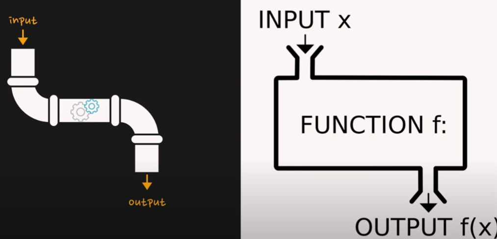

# 함수형 프로그래밍

:question:많은 사람들이 묻는 질문:question:

- 함수형 프로그래밍 vs 객체 지향 프로그래밍
- 둘 중 어떤게 더 좋나요?

- 함수형 프로그래밍이 더 잘나가는 진화된 트렌드 인가요?
- 함수로만 작성하는게 함수형 프로그래밍 인가요?

---

- 프로그램 패러다임 

  - 절차 지향 프로그래밍, 객체 지향 프로그래밍, 함수형 프로그래밍, 함수형 반응형 프로그래밍 이러한 것들

  - 프로그램을 만들 때에도 원하는 목표에 따라서 적절한 방법과 기법으로 프로그램을 만들게 된다.


### 함수형 프로그래밍:star:

- 많은 프로그래밍 언어 중 **함수형 프로그래밍 만을 위한 Haskell 이나 OCaml 과 같은 함수형에 특화된 프로그래밍 언어.**
  - F#

  - Haskell
  - OCaml 
  - Erlang

- **함수형 프로그래밍에서 쓰이는 몇 가지 특징들을 접목한 프로그래밍 언어**가 존재한다. 
  - Javascript
  - Kotlin
  - Go
  - Python
  - Java
  - C++ 등




---

- 프로그래밍 역사 

  - 1958년 LISP 첫 함수형 프로그래밍


  - 1962 Simula , 1972 Smailltalk   : 첫 객체 지향 프로그래밍언어

    -> 함수형 프로그래밍이 먼저 나왔다?! 

    원래 함수형 프로그래밍은 수학의 원리와 밀접하게 연관되어있기 때문에 배우는데 시간이 조금 걸리고 난해함.
    
    그래서 사람의 사고와 가까운 절차 프로그래밍/ 객체 지향 프로그래밍이 더 많이 쓰여져 왔다.(ex 대학) 
    
    

- **그럼 왜 최근부터 주목받게 되었을까?**  :point_left:

  - 요즘 AI IOT 빅데이터 비트코인이 뜨기 시작하면서 방대한 데이터를 빠르게 계산해서 

    <u>**병렬적으로 안정적으로 처리하기위해서**</u> 함수형 프로그래밍 언어가 다시 주목 받기 시작함! 

  - 함수형 프로그래밍은 **<u>수학과 밀접하게 관련</u>**이 있으므로 수학에서는 주어진데이터를 처리해서 결과값을 도출한다. 

  - INPUT을 넣으면 어떠한 처리과정을 거쳐서 OUTPUT 즉 결과가 나오게 된다.

  - 외부에서는 내부의 파이프라인 상태를 보거나 접근할수 없다. 파이프라인안에서도 밖에 접근할수 없다.


- **함수 프로그래밍을 배워야 하는 이유**

  - 함수형 프로그래밍은 기존 절차적 프로그래밍과 객체 지향형 프로그래밍과는 다른 새로운 방식이다. 함수형 프로그래밍을 배우는 것은 스칼라나 클로저에 관심이 없고 앞으로 쓰지 않을 것 같다고 해도 **다른 방식으로 사고하는 법을 배우는 것**이다.

    새로운 계산 방법을 배우는 것처럼 사고의 전환을 필요로 하며 **다양한 사고방식으로 프로그래밍을 바라보면 유연한 문제해결이 가능**하다.


---

### 특징:star2:

1. **순수함수** Pure Fuctions

- 함수에서 외부의 상태 값을 참조하거나 또한 외부의 상태를 변경하는 것은 순수함수가 아니다.
  
- **동일한 인자를 넣었을 때 항상 동일한 결과 값을 반환하고 언제 선언이 되었는지 외부에 전혀 영향을 받지 않도록 작성**해야한다. 
  
- 함수 안에서 외부의 상태 값을 바꾼다면 그건 함수형 프로그래밍이 아니라 절차 지향형 프로그래밍이다. 


  ```python
  # 이건 순수함수가 아니다. 
  num = 1
  
  def add(a):
      return a+num
  
  # 순수 함수
  def add(a,b):
      return a+b
  
  result = add(2,3)
  ```

  

2. **비상태 불변성** Stateless, Immutability

- 함수에 인자로 전달된 **데이터를 변경하는 것은 절대 함수형**이 아니다. 

- 함수형 프로그래밍은 전달된 데이터를 **새로운 버전의 새로운 오브젝트를 만들어서 결과값으로 전달**해야한다.

- 즉,  함수형 프로그래밍에서는 외부의 상태나 함수에 인자로 전달된 데이터의 상태를 변경하지 않음으로서 **side effect를 발생 시키지 않으므로** 불변성을 유지하기 때문에 여러가지 동시 다발적인 멀티쓰레드 환경에서도 안정적으로 동작할 수 있다.

  - side effect :  함수를 호출하면 외부의 상태가 변경되거나 예상하지 못한 에러 발생하는 부작용

   

3. **expressions 를 써야한다**!

- if 나 switch, for 과 같은 여러가지 문장을 사용하는건 함수형 프로그래밍이 아니다.

- for 문 사용해서 반복문 도는건 함수형 프로그래밍이 아니다. 

- **if나 switch for문을 사용하지 않고 프로그래밍해 나가는 것**이다.

  

4. **First-class and higher-order functions**

- **일급함수(first class)**
- 다른 데이터와 마찬가지 함수를 변수에 할당하거나 함수에 인자로 전달하거나 리턴하는 등의 일들을 할 수있음.
-  **고차함수(higher-order functions)**
  - 함수 자체를 인자로 전달하거나 함수에서 또 다른 함수로 리턴하는 특징을 가지고 있어야한다. (ex 재귀함수) 
  

---

### 함수형 프로그래밍의 장단점 :key:


##### 장점

1. **높은 수준의 추상화**를 제공한다
2. 함수 단위의 **코드 재사용이 수월**하다
3. 불변성을 지향하기 때문에 프로그램의 **동작을 예측하기 쉬워진다**


##### 단점

1. 순수 함수를 구현하기 위해서는 코드의 **가독성이 좋지 않을 수 있다**
2. 함수형 프로그래밍에서는 반복이 for문이 아닌 재귀를 통해 이루어지는데 (deep copy), 재귀적 코드 스타일은 **무한 루프**에 빠질 수 있다
3. 순수 함수를 사용하는 것은 쉬울 수 있지만 조합하는 것은 쉽지 않다

---

### 결론 :deciduous_tree:

- **함수형 프로그래밍을 이용해서 프로그램을 만든다는 것** 은 **위에 언급한 특징을 가진 함수들을 적용하고 묶어서 프로그램을 구성해 나가는 것** 을 말한다.
- 많은 프로그래밍 언어 특히 최선 버전에 함수형 프로그래밍의 특징들이 더해진 것처럼 **함수형 프로그래밍의 특징들을 잘 활용해서 더 안정성있는 프로그래밍이 가능**하다.
- 뭐 어떤게 더 좋다고 할 수 없고, 원하는 목적 목표에 에 따라서 특징을 가진 함수들을 적용하고 프로그래밍 해서 문제를 해결하면 된다~~ 

