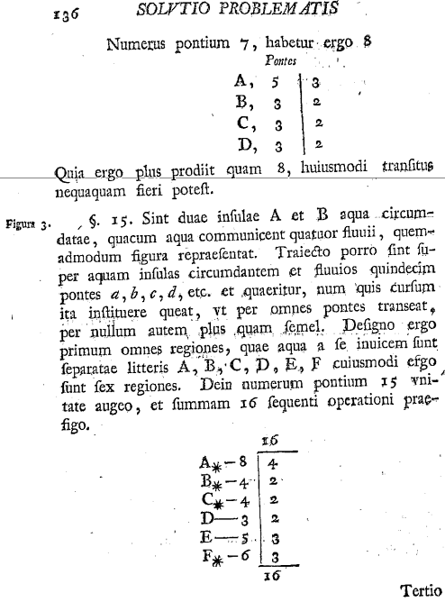

- [Graph_Representations_Traversal](#graph-representations-traversal)
  * [Concepts](#concepts)
  * [Representations](#representations)
    + [Adjacency Matrix](#adjacency-matrix)
    + [Adjacency List](#adjacency-list)
  * [Traversal](#traversal)
    + [Depth First Search](#depth-first-search)
    + [Breadth First Search](#breadth-first-search)
  * [[참고] 쾨니히스베르크의 다리 문제](#-------------------)
  * [참고 주소](#-----)

# Graph_Representations_Traversal

> [CS Academy / Apps / Graph Editor](https://csacademy.com/app/graph_editor/)

## Concepts

그래프는 현상이나 사물 간의 관계를 표현하는 자료구조이다.

- 오일러 문제 (한붓그리기, 쾨니히스베르크의 다리 문제)

  - 모든 다리를 한번만 건너 처음 출발했던 장소로 돌아오는 문제

    - 위치 : 정점 Node, Vertices

    - 다리 : 간선 Edge, Link

- Adjacent Vertex 인접 정점
  - 두 노드가 간선으로 연결되어 있으면 인접하다고 한다.
- Degree 차수
  - 노드에 연결된 다른 노드의 수
- Path 경로
  - 노드의 나열로 표현
  - simple path 단순 경로, cycle 사이클
- Undirected Graph, Directed Graph
- Complete Graph 완전 그래프
  - 모든 노드가 연결되어 있는 그래프

## Representations

그래프 표현 방법은 인접 행렬 방법과 인접 리스트 방법이 있다.

**수행 시간**

- 인접 행렬: $O(n^2)$
- 인접 리스트: $O(n+e)$

### Adjacency Matrix

인접 행렬은 **2차원 배열** 사용 표현

대각선 성분은 모두 0

유향 그래프의 경우 인접 행렬이 비대칭이며, 연결되는 간선이 있는지를 나타낸다

무방향 그래프의 경우 인접 행렬이 대칭이다

### Adjacency List

인접 리스트는 각 정점에 인접한 노드들을 **연결 리스트**를 사용 표현

각 노드는 자신의 연결 리스트를 하나씩 유지하고, 자신의 연결 리스트에 자신이 연결된 노드를 항목으로 추가

## Traversal

순회(탐색)는 그래프의 가장 기본적인 연산이다.

하나의 노드로부터 시작하여 차례대로 **그래프의 모든 노드들을** 한번씩 **방문**하는 일

대표적으로 깊이 우선 탐색과 너비 우선 탐색이 있다.

| 응용                                                         | DFS  | BFS  |
| ------------------------------------------------------------ | ---- | ---- |
| 신장 트리, 연결 성분, 경로, 사이클                           | DFS  | BFS  |
| 최소 간선을 사용하는 경로, [Bacon Number](https://oracleofbacon.org/), [Erdős number](https://mathworld.wolfram.com/ErdosNumber.html) |      | BFS  |
| 위상 정렬, 이중 연결 성분, 강 연결 성분                      | DFS  |      |

### Depth First Search

깊이 우선 탐색은 시작 노드에서 멀어지는 방향으로 탐색을 진행

한 방향으로 갈 수 있을 때까지 계속 가다가 더 이상 갈 수 없게 되면, 다시 가장 가까운 갈림길로 돌아와서 이 곳으로부터 다른 방향으로 다시 탐색을 진행

되돌아가기 위해서는 **스택 필요**

- 순환함수 호출로 묵시적인 스택 이용 가능

### Breadth First Search

너비 우선 탐색은 **시작 노드로부터 가까운 노드를 먼저 방문**하고, 멀리 떨어져 있는 노드를 나중에 방문하는 순회 방법이다.

큐를 이용하여 구현

---

## [참고] 쾨니히스베르크의 다리 문제

## 참고 주소

[Euler, Leonhard, "Solutio problematis ad geometriam situs pertinentis" (1741). Euler Archive - All Works. 53.](http://eulerarchive.maa.org//docs/originals/E053.pdf)

[그래프, 자료처리, 2019-2, 강원대학교 컴퓨터공학과 이창기 교수](https://cs.kangwon.ac.kr/~leeck/DS2/DS_10.pdf)

[그래프, 자료구조, 2019-1, 창원대학교 정보 시각화 연구실](http://ivis.kr/images/4/41/10.%EA%B7%B8%EB%9E%98%ED%94%841%282019%29.pdf)

[그래프, 자료구조, 2018-1, 창원대학교 정보 시각화 연구실](http://ivis.kr/images/f/fc/2018_DS_ch11.pdf)

[그래프, 파이썬과 함께하는 자료구조의 이해, 2018, 연세대학교 컴퓨터과학과 양성봉 교수](https://www.booksr.co.kr/html/book/book.asp?seq=697039)

[그래프 알고리즘, 2016-1, 전북대학교, 인지컴퓨팅 연구실](https://nlp.jbnu.ac.kr/AL/ch09.pdf)

[그래프 알고리즘, 알고리즘, 2015-1, 부경대학교 IT융합응용공학과 권오흠 교수](http://contents2.kocw.or.kr/KOCW/document/2015/pukyong/kwonoeum/6.pdf)

[그래프, 자료구조, 2011,  상지대학교 컴퓨터공학과 고광만 교수](http://compiler.sangji.ac.kr/lecture/ds/2011/lecture08_Graph.pdf)

